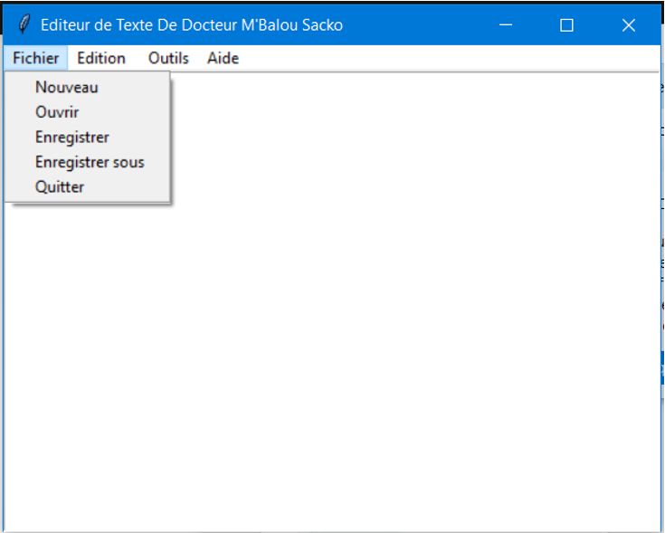

# Editeur en Python 3

## Résumé 
Dans ce projet, j'ai réalisé un mini éditeur en python qui permet de:
* créer un fichier au format text
* copier un text
* coller
* couper
* ....
avec la bibliothèque tkinter de python

## Vue de l'éditeur

